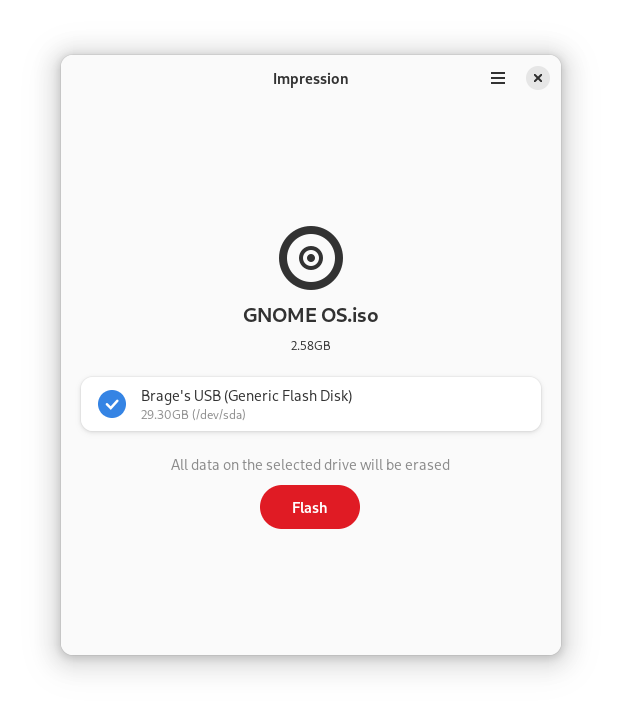

<div align="center">
<h1>Impression</h1>

A straight-forward and modern application to create bootable drives.


[](https://flathub.org/apps/details/io.gitlab.adhami3310.Impression)
[](https://gitlab.com/adhami3310/Impression/-/tags)
[](https://gitlab.com/adhami3310/Impression/-/raw/main/COPYING)

</div>

## Installation
<a href='https://flathub.org/apps/details/io.gitlab.adhami3310.Impression'></a>


### Third Party Packages
You may also be able to obtain Impression from your distribution's package manager. Note these packages are maintained independently and thus may differ from the official version on Flathub. Please report any issues experienced to the package maintainer.

[](https://repology.org/project/impression/versions)

## About

Write disk images onto your drives with ease. Select an image, insert your drive, and you're good to go! Impression is a useful tool for both avid distro-hoppers and casual computer users. See [Press](PRESS.md) for content mentioning Impression from various writers, content creators, etc.



## Contributing
Issues and merge requests are more than welcome. However, please take the following into consideration:

- This project follows the [GNOME Code of Conduct](https://wiki.gnome.org/Foundation/CodeOfConduct)
- Only Flatpak is supported
- The amount of features is intentionally restricted, to keep the app minimal and optimized for the target use case. If you'd like a more general-purpose disk utility, check out [GNOME Disks](https://apps.gnome.org/DiskUtility/).

## Development

### GNOME Builder
The recommended method is to use GNOME Builder:

1. Install [GNOME Builder](https://apps.gnome.org/Builder/) from [Flathub](https://flathub.org/apps/org.gnome.Builder)
1. Open Builder and select "Clone Repository..."
1. Clone `https://gitlab.com/adhami3310/Impression.git` (or your fork)
1. Press "Run Project" (▶) at the top, or `Ctrl`+`Shift`+`[Spacebar]`.

### Flatpak
You can install Impression from the latest commit:

1. Install [`org.flatpak.Builder`](https://github.com/flathub/org.flatpak.Builder) from Flathub
1. Clone `https://gitlab.com/adhami3310/Impression.git` (or your fork)
1. Run `flatpak run org.flatpak.Builder --install --user --force-clean build-dir io.gitlab.adhami3310.Impression.json` in the terminal from the root of the repository.

### Meson
You can build and install on your host system by directly using the Meson buildsystem:

1. Install `blueprint-compiler`
1. Run the following commands (with `/usr` prefix):
```
meson --prefix=/usr build
ninja -C build
sudo ninja -C build install
```

### Credits

Actively developed by Khaleel Al-Adhami.

Brage Fuglseth helps a lot with desgin decisions.

Huge thanks to all of the translators who brought Impression to many other languages!

This app was inspired by [this mockup](https://gitlab.gnome.org/Teams/Design/whiteboards/-/issues/143) by [Saptarshi Mondal](https://gitlab.gnome.org/gitSaptarshi).

The app uses significant portions of [popsicle](https://github.com/pop-os/popsicle).
